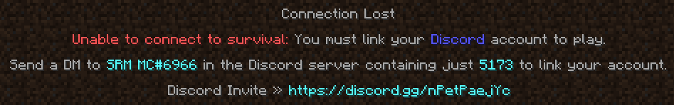
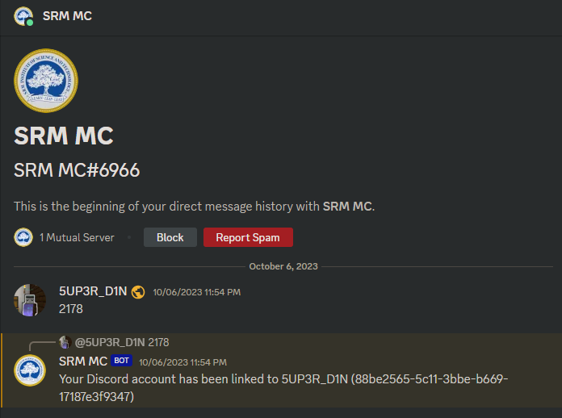
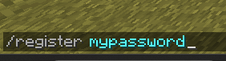

# Verification & Security

Our server have 2 layers of security, to ensure that there is no bot in the server, and players doesnt get hacked

## Discord verification

After you first joined the minecraft server, the server will ask you to DM the bot:

Simply DM the bot like the this:

Once you passed the discord verification, you can now rejoin the server.

:::info Reason of linking
This method of verification can significantly decrease amount of bots, and also make system able to sync many things between ingame and discord.
:::

## Password-protected account

After you joined the server, it will ask you to register.

Simply run `/register mypassword` or `/reg mypassword`

For next time, it will instead ask you to login, the password will be the same as the one you registered, and command will be `/login mypassword` or `/l mypassword`

:::info 
If your password is lost, and you cannot login, please tell us via discord
:::